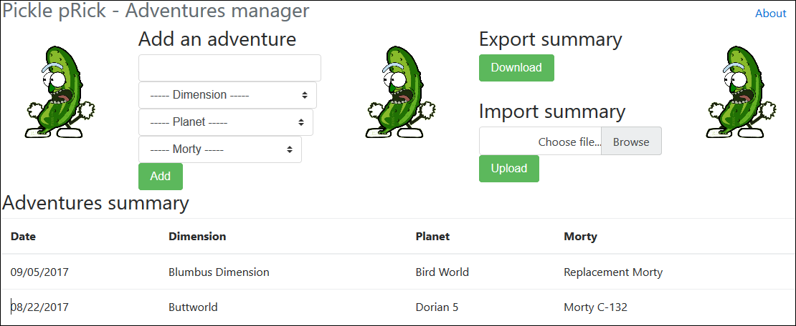
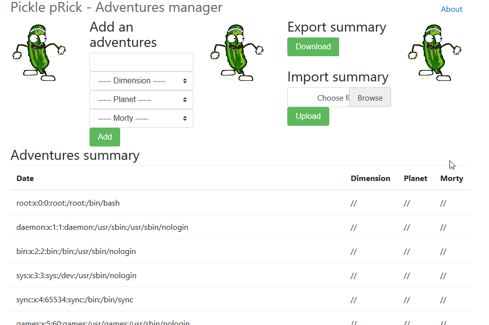

# Pickle Prick

A vulnerable web application to explain and illustrate deserialization of untrusted data with Pickle.

**Warning ! Don't run this application on an Internet facing interface !!!**

For more information, see [my blog article](https://dan.lousqui.fr/explaining-and-exploiting-deserialization-vulnerability-with-python-en.html)

## Goal

From this:

Try to get this :

